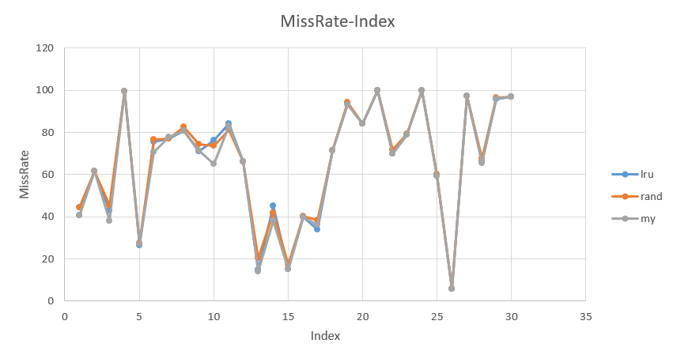
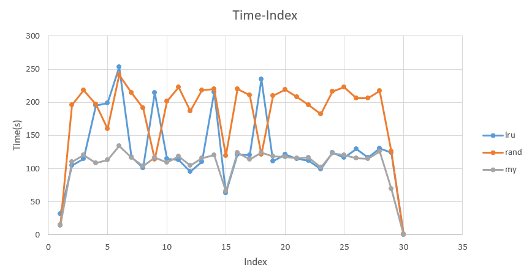

# 计算机系统结构实验1报告

2014011349 计43 杨皖宁


## 已经提出的Cache替换策略的核心思想和算法

LRU：
 - LRU的核心思想在于根据数据的历史访问信息来对cache中的数据进行筛选，这一思路建立在"近期被访问过的数据在未来也很有可能被访问"这一基础上。
 - 这一基于局部性的策略有着不错的表现，但也存在缺点。LRU仅考虑数据的最近访问历史信息，但没有利用数据被访问的频率;此外，当Cache容量小于工作集时，LRU会出现严重的抖动，即连续发生被替换出Cache的数据块又被访问，不断发生冲突缺失。

LFU：
 - LFU的核心思路是根据数据近期访问次数来进行cache替换。其核心思路是"如果一个数据在最近一段时间内使用次数很少，那么在将来一段时间内被使用的可能性也很小"这样的基于局部性的推理。
 - 通常来说LFU有着不错的效率，并且LFU能避免周期性或偶发性的操作导致缓存命中率下降的问题。然而LFU的缺点也很明显，其需要维护数据访问的历史次数，开销比较大；此外，一旦数据访问模式改变，LFU需要更长时间来适用新的访问模式，即"LFU的惯性很大"。

Simpler and Faster Police
 - 这一系列类似LRU，其在速度或是实现上有着提升
 - BT：通过二叉树来实现LRU，每个结点记录其子节点的相对新/旧关系，不断的朝着旧的子节点搜索，让最旧的叶子被替换。
 - NRU：维护1bit的标志位来记录近期内该内容是否被访问过，替换时，根据标志位随机地选择最近未被访问过的项。
 - MNRU：更简化的NRU，仅维护一个指针，该指针指向最近被访问的项，替换时，在没有被指针指向的内容中随机选择一个。

LIP：
 - LRU对高局部性的工作集有相当好的表现，但是对于当Cache容量小于工作集的情况性能不太好。LIP正是为此提出。
 - LIP则将新的访问位置放在LRU位置。只有当它们存在LRU位置中被引用时，才将它们提升到MRU位置中。
 - 这一算法的结果是，数据先被放到LRU位置上，处理器开始访问，由于LRU上的数据正是处理器需要的数据，所以马上会被放到MRU位置上，由此LRU位置上的一部分数据会保存在cache中，提高了cache的命中率。

BIP：
 - BIP中引入了参数ε，它是一个很低的概率，用来控制新进来的数据被替换到MRU位置上的比例。我们随机生成0~1的随机数，当该值小于ε时，将新的访问集放入MRU位置；否则大多数情况下会被放入LRU位置。不难发现ε=1时，BIP退化为LRU；ε=0时，BIP退化为LIP。

RRIP：
 - RRIP的核心思路是尽量把访问间隔小的数据块留在cache中，从而提高命中率。
 - 维护M bits位记录PPRV
 - 选择PPRV值最大（2^M-1 ）的块换出cache。即从一端开始扫描，将第一个遇到的PPRV值为2^M-1的块将其换出；若没有，则将所有的RRPV值加1，重复上述扫描。
 - 对于新插入的数据块，将它的RRPV值设为2^M-2。这样做可以使得新的数据块在cache中存在的时间不至于太长也不太短.
 - 当cache命中时，将命中块的RRPV值设为0。


## 自己设计的Cache替换策略

我的Cache替换策略是基于SRRIP的，在此基础上做了一点改进：在`RRPV`值的维护上，我允许该值为负数，而每一次访问cache命中时，有较低的概率对负的`RRPV`进行清零。改进理由有以下几点：
 - 原始的SRRIP算法在`RRPV`值为0时就不在让其减小，即数据的访问到达一定的频繁程度后，`RRPV`值均为0，无法反映出不同频繁程度的区别；而我的改进中允许该值为负，从而使`RRPV`值更能反映该数据被访问的频繁程度
 - 此外不能让`RRPV`值无限制的减少下去。考虑这样一种情况，某一数据在某一段时间内被多次访问，其`RRPV`值是一个绝对值很大的负数，而接下来的时间内，该数据不会再被访问，但由于之前的"积累"，其`RRPV`值很难在短时间内达到上界而被换出。为了避免这种"年龄很大"的数据残留在cache中，引入了随机清零的机制，这样做减少了上述情况带来的cache性能下降


具体实现如下：
 - 初始化：
     - 这一部分设置了后续需要使用的常量。`M`为`RRPV`所占位数；`DIST_RRPV`为`RRPV`的最大值，最先找到的等同于这一值的行将被换出；`LONG_RRPV`为新的内容被换进cache时`RRPV`的初始值。
     - 实现在`InitReplacementState()`中，代码如下：
```
M = 2; 
DIST_RRPV = ((1 << M) - 1);
LONG_RRPV = ((1 << M) - 2);

for(UINT32 setIndex = 0; setIndex < numsets; ++setIndex) 
    for(UINT32 way = 0; way < assoc; ++way) 
        repl[setIndex][way].RRPV = DIST_RRPV;
```
 - 替换策略：
     - 我们从头开始遍历，找到的第一个`RRPV`值为`DIST_RRPV`的元素，该元素即为将要被替换的对象；若遍历一遍仍未找到符合上述要求的元素，则将所有元素的`RRPV`值加一，然后重复上述遍历，直到找到被换出的元素为止。
     - 实现在`Get_My_Victim(UINT32 setIndex)`中，代码如下：
```c
INT32 CACHE_REPLACEMENT_STATE::Get_My_Victim(UINT32 setIndex) 
{	
	bool found = false;
	UINT32 way_dist_rrpv = 0;
       
    while (!found) {
	    for (UINT32 way = 0; way < assoc; ++way) {
		    if (repl[setIndex][way].RRPV == (int)DIST_RRPV) {
			    found = true;
			    way_dist_rrpv = way;
			    break;
		    }
        }

	    if (!found) {	
		    for (UINT32 way = 0; way < assoc; ++way) {
			    if (repl[setIndex][way].RRPV < (int)DIST_RRPV)
				    repl[setIndex][way].RRPV++;			    		
		    }
	    }
	}
	
	return way_dist_rrpv;
}
```
 - 更新策略：
     - 比起LRU，这里多传入了`cacheHit`作为参数，这一参数表示访问cache元素是否命中
        - 若未命中则将新插入的元素的`RRPV`设置为`LONG_RRPV`
        - 若命中，则将`RRPV`值减一；同时以某一较小的概率(这里用了1%)将所有的负的`RRPV`值清零
     - 实现在`UpdateMyPolicy(UINT32 setIndex, INT32 updateWayID, bool cacheHit)`中，代码如下：
```c
void CACHE_REPLACEMENT_STATE::UpdateMyPolicy(UINT32 setIndex, INT32 updateWayID, bool cacheHit)
{
	if(!cacheHit) {
		repl[setIndex][updateWayID].RRPV = LONG_RRPV;
	}
	else {
		repl[setIndex][updateWayID].RRPV--;
        if (rand() % 100 < 1) {
            for (UINT32 way = 0; way < assoc; ++way) {
				if (repl[setIndex][way].RRPV < 0)
					repl[setIndex][way].RRPV = 0;		
			}
        }       
	}
}

```


## 通过benchmark测试比较不同的Cache替换策略

运行时间（使用time指令得到的结果）：
| Trace/Time(s) | LRU | Random | MyPolicy |
|:---------------------|:-------|:-----|:-----|
| 465.tonto.out.trace.gz  | 99.30       | 182.34 | 102.25 | 
| 450.soplex.out.trace.gz  | 62.91      | 119.79 | 66.42  | 
| 401.bzip2.out.trace.gz  | 104.28      | 196.31 | 109.83 | 
| 434.zeusmp.out.trace.gz  | 100.69     | 191.46 | 103.86 | 
| 403.gcc.out.trace.gz  | 114.89        | 218.00 | 120.62 | 
| 471.omnetpp.out.trace.gz  | 117.04    | 223.03| 120.84 | 
| 458.sjeng.out.trace.gz  | 111.47      | 210.25| 118.26 | 
| 437.leslie3d.out.trace.gz  | 112.73   | 222.77 | 118.29 | 
| 444.namd.out.trace.gz  | 95.76        | 186.40 | 104.81 | 
| 445.gobmk.out.trace.gz  | 110.37      | 217.76 | 115.09 | 
| 462.libquantum.out.trace.gz  | 114.82 | 207.65| 115.79 | 
| 482.sphinx3.out.trace.gz  | 116.28    | 206.54 | 114.61 | 
| 453.povray.out.trace.gz  | 121.32     | 219.88 | 123.72 | 
| 464.h264ref.out.trace.gz  | 112.06    | 196.45 | 116.73 | 
| ls.out.trace.gz  | 0.51               | 0.97   | 0.56   | 
| 433.milc.out.trace.gz  | 117.69       | 214.70 | 116.25 |
| 454.calculix.out.trace.gz  | 120.77   | 210.62 | 113.90 | 
| 459.GemsFDTD.out.trace.gz  | 121.59   | 218.69 | 117.72 |
| 470.lbm.out.trace.gz  | 124.22        | 216.42 | 123.61 |
| 483.xalancbmk.out.trace.gz  | 130.25  | 216.98 | 126.19 | 
| 436.cactusADM.out.trace.gz  | 114.54  | 201.61 | 109.73 | 
| 473.astar.out.trace.gz  | 129.30      | 206.15 | 115.89 |
| 447.dealII.out.trace.gz  | 215.30     | 219.88 | 120.19 |
| 429.mcf.out.trace.gz  | 252.89        | 241.08 | 134.20 |
| 999.specrand.out.trace.gz  | 124.01   | 125.51 | 69.33  |
| 410.bwaves.out.trace.gz  | 195.20     | 197.03 | 108.47 |
| 416.gamess.out.trace.gz  | 199.17     | 159.77 | 112.61 |
| 435.gromacs.out.trace.gz  | 214.42    | 113.57 | 116.64 |
| 456.hmmer.out.trace.gz  | 234.60      | 121.65 | 123.62 |
| 400.perlbench.out.trace.gz  | 31.76   | 15.03  | 14.65  |


缺失率：
| Trace/MissRate(%) | LRU | Random | MyPolicy |
|:---------------------|:-------|:-----|:-----|
| 465.tonto.out.trace.gz  | 78.8694     | 79.4314 | 78.8456 |
| 450.soplex.out.trace.gz  | 15.2011    | 17.5536 | 15.3259 |
| 401.bzip2.out.trace.gz  | 61.7369     | 61.6783 | 61.6434 |
| 434.zeusmp.out.trace.gz  | 80.81      | 82.6395 | 80.6436 |
| 403.gcc.out.trace.gz  | 42.7521       | 45.6397 | 38.0513 |
| 471.omnetpp.out.trace.gz  | 59.4443   | 60.0557 | 59.3405 |
| 458.sjeng.out.trace.gz  | 93.5415     | 94.1036 | 93.32   |
| 437.leslie3d.out.trace.gz  | 84.0284  | 81.1201 | 82.9516 |
| 444.namd.out.trace.gz  | 66.2603      | 66.3123 | 66.2603 |
| 445.gobmk.out.trace.gz  | 14.919      | 20.4838 | 13.8782 |
| 462.libquantum.out.trace.gz  | 100    | 100     | 100     |
| 482.sphinx3.out.trace.gz  | 97.156    | 97.262  | 97.156  |
| 453.povray.out.trace.gz  | 39.9258    | 40.2017 | 39.8399 |
| 464.h264ref.out.trace.gz  | 70.0086   | 71.7721 | 70.0665 |
| ls.out.trace.gz  | 96.9842            | 96.9842 | 96.9842 |
| 433.milc.out.trace.gz  | 77.0164      | 76.9488 | 77.8208 |
| 454.calculix.out.trace.gz  | 34.05    | 38.3193 | 36.1531 |
| 459.GemsFDTD.out.trace.gz  | 84.1525  | 84.1525 | 84.1525 |
| 470.lbm.out.trace.gz  | 99.9725       | 99.9392 | 99.9654 |
| 483.xalancbmk.out.trace.gz  | 66.2759 | 67.5795 | 65.3017 |
| 436.cactusADM.out.trace.gz  | 76.1164 | 73.7824 | 65.116  |
| 473.astar.out.trace.gz  | 5.84718     | 5.84718 | 5.84718 |
| 447.dealII.out.trace.gz  | 45.0892    | 41.7856 | 38.0171 |
| 429.mcf.out.trace.gz  | 75.676        | 76.6834 | 70.6576 |
| 999.specrand.out.trace.gz  | 95.9373  | 96.3212 | 96.0013 |
| 410.bwaves.out.trace.gz  | 99.6634    | 99.6634 | 99.6634 |
| 416.gamess.out.trace.gz  | 26.3204    | 27.6546 | 27.2513 |
| 435.gromacs.out.trace.gz  | 71.1979   | 74.3719 | 71.5179 |
| 456.hmmer.out.trace.gz  | 71.4736     | 71.4736 | 71.4736 |
| 400.perlbench.out.trace.gz  | 40.7952 | 44.4057 | 40.7312 |


## 不同替换策略下，程序的运行时间、Cache命中率受到的影响

首先给出缺失率、运行时间关于索引Index的图表（这里Index对应trace中的各个测例，从小到大依次对应，例如Index 1对应400，Index 2对应401...Index 30对应999，Index 31对应ls）：




